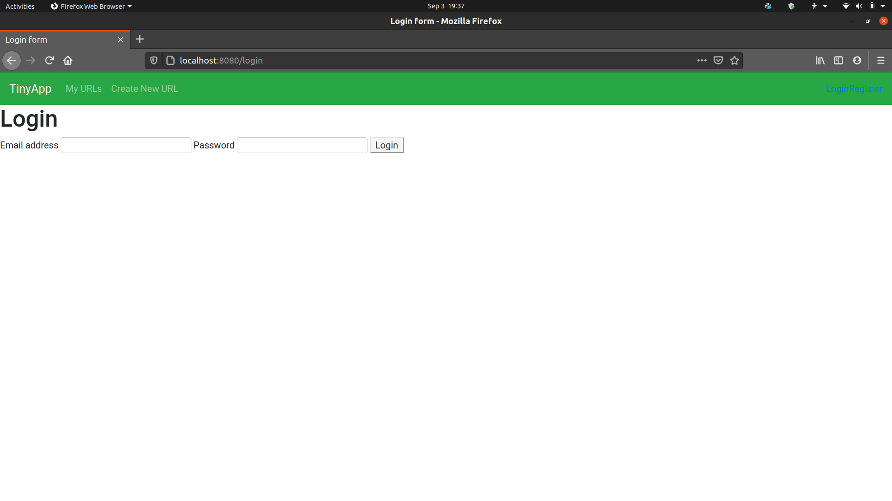
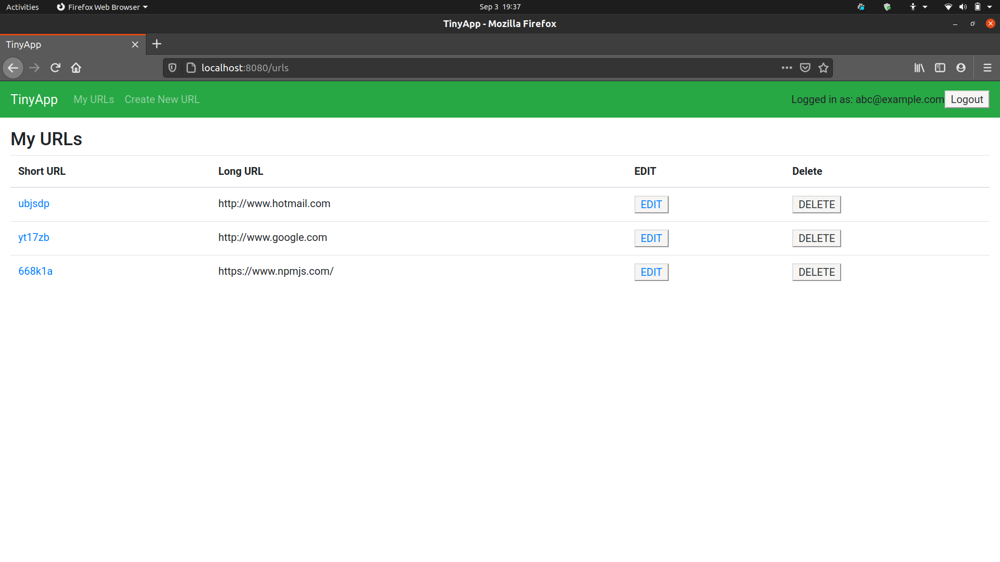
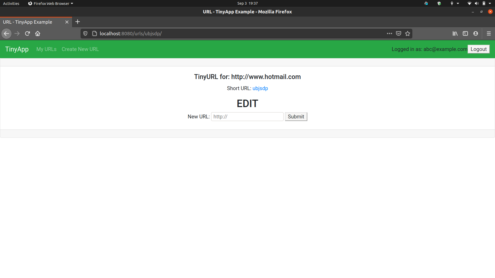

# TinyApp Project

## Description
TinyApp is a full stack web application built with Node and Express that allows users to shorten long URLs (à la bit.ly). This is my first project built from the ground-up witht little assistance from the Lighthouse mentors and instructors.

The project allows users to not only shorten the links but also edit and delete the existing links as long they are registered and signed-in to their account. 

## About the Project
* URLs are saved in the database to be accessed by user upon logged-in.
* Users are require to register in order to access the URL shortner, edit and delete the existing URLs.
* Users' passwords are hashed and not saved in plain text.
* Users' ID's are encrypted.


## Final Product





## Dependencies

- Node.js
- Express
- EJS
- bcrypt
- body-parser
- cookie-session
- morgan

## Getting Started

>Install all dependencies 
```
npm install
```
>Run the development web server using the
```
node express_server.js
```
 Mocha and Chai were uninstalled at the end of the project along with the test code.

